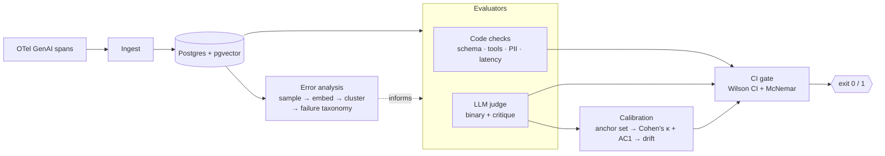

<div align="center">

# EvalGate

**A CI gate for LLM agents — the test-suite step that blocks a bad agent version from shipping.**

Most "LLM eval" tooling is a dashboard you glance at. EvalGate is a *gate*: it starts from your
real failures, evaluates with code checks + a calibrated LLM judge, and **fails the build** when
agent quality regresses — or when the judge itself drifts out of agreement with humans.

[](LICENSE)
[](pyproject.toml)
[](https://github.com/astral-sh/ruff)
[](tests)

</div>

---

## Why

> In the 2025 *State of Agent Engineering* survey, **89% of teams running agents had observability
> — but only ~52% ran evals.** Observability tells you what happened; it doesn't stop a worse
> version from shipping.

EvalGate is the missing half: the pipeline step that turns "is this agent version good enough?"
into a single, defensible pass/fail.

It is opinionated in three ways that make the number trustworthy:

1. **Error-analysis first, not metric-first.** Before you write a single assertion, you look at
   your failures. EvalGate samples failing traces, embeds them, and clusters them into a
   **failure taxonomy** so your evaluators target the failure modes you actually have — the
   [Hamel Husain](https://hamel.dev/blog/posts/evals-faq/) / [Shreya
   Shankar](https://arxiv.org/abs/2404.12272) "look at your data" discipline, wired into the tool.
2. **The judge is calibrated, not trusted.** The LLM judge is re-scored against a frozen,
   human-labeled **anchor set** every run. EvalGate reports **Cohen's κ** (agreement corrected
   for chance) cross-checked against **Gwet's AC1** (to catch the prevalence paradox). If κ falls
   below threshold, the run is blocked and flagged as *judge drift* — not agent regression.
3. **Binary verdicts + statistics that survive tiny samples.** The judge answers pass/fail with a
   written critique (Likert scores are noise). The gate reads the **lower bound of a Wilson score
   interval**, and compares two agent versions with **McNemar's paired test**, so a two-sample
   wobble can't flip the build.

## Architecture



## Quickstart

```bash
pip install -e ".[dev]"      # or: make install
cp .env.example .env         # add a free Groq key for the judge (optional to start)
python -m examples.eval_flint_parser
```

The reference integration points EvalGate at an NL→DAG parser and runs the whole pipeline —
code checks, the calibrated judge, and the gate — end to end:

```text
┌──────────────────────────────────────────────────────────────┐
│ EVALGATE                                                       │
├──────────────────────────────────────────────────────────────┤
│ result       : PASS  (exit 0)                                  │
│ pass-rate    : 0.940  95% CI [0.902, 0.970]  (wilson, 47/50)   │
│ min pass-rate: 0.900                                           │
│ judge kappa  : 0.810 (substantial)  min 0.70  drifted=False    │
│ judge agree  : AC1 0.830  raw 0.900  TPR 0.920  TNR 0.880      │
│ vs baseline  : +2 fixed / -0 regressed  (inconclusive)         │
├──────────────────────────────────────────────────────────────┤
│ RESULT: PASS                                                   │
└──────────────────────────────────────────────────────────────┘
```

The gate exits non-zero when the pass-rate CI lower bound drops below `min_pass_rate`, when a
McNemar test says the change is a significant regression, **or** when the judge's κ drops below
`min_judge_kappa`. Drop it into any CI job.

## How the gate decides

| Signal | Fails the build when… | Why |
|---|---|---|
| **Pass-rate** | Wilson 95% CI *lower bound* < `min_pass_rate` | A lucky small sample can't sneak past the gate |
| **Version delta** | McNemar paired test flags a significant regression vs baseline | The two runs are paired (same inputs) — compare correctly |
| **Judge drift** | Cohen's κ vs the human anchor set < `min_judge_kappa` | A judge that no longer matches humans can't be trusted to grade |

## What's inside

- **`evalgate.analysis`** — error-analysis workbench: sample failing traces → embed
  (a $0, offline TF-IDF encoder by default) → cluster into an auto-labeled failure taxonomy.
- **`evalgate.evaluators`** — deterministic code checks (schema / tool success / PII / latency)
  and a binary LLM judge (chain-of-thought → verdict → critique) with length/position/self-
  preference bias mitigation and an order-swapped pairwise mode.
- **`evalgate.calibration`** — Cohen's κ + Gwet's AC1 + TPR/TNR against the anchor set, with
  degenerate-case and prevalence-paradox handling, plus a bias-corrected pass-rate.
- **`evalgate.stats`** — Wilson score interval, McNemar's exact paired test, Landis–Koch bands.
- **`evalgate.gate`** — composes the above into one structured `GateReport` and a shell exit code.

## Privacy & cost

EvalGate runs locally and is **$0 to operate**: the default embedding encoder needs no model
download and no network, and the LLM judge uses any OpenAI-compatible endpoint (the Groq free
tier by default; bring your own key). Your prompts, traces, anchors, and thresholds are files in
**your** repo — nothing is sent anywhere except the judge model you configure.

## Status

The evaluation core (analysis, evaluators, calibration, statistics, gate) is implemented and
tested. In active development: the `evalgate` CLI, a pytest plugin, a base-vs-PR GitHub Action
that comments on the PR, the OTel-GenAI ingestion adapter, and the instrument-panel dashboard.

## Reference integration

[`examples/eval_flint_parser.py`](examples/eval_flint_parser.py) evaluates an NL→DAG parser:
code checks are *is-a-DAG* (Kahn's algorithm), legal node types, and edges-resolve; the judge
checks that the plan faithfully represents the request (no missing or hallucinated steps).

## License

[MIT](LICENSE)
