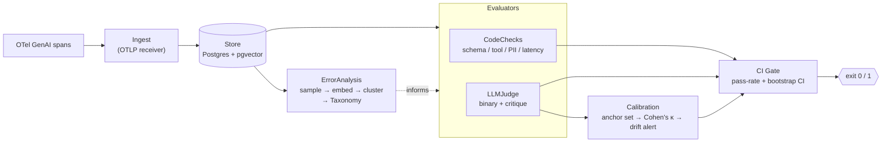

# EvalGate

**An error-analysis-first eval + observability harness for LLM agents — that also watches its own judge for drift.**

> The gate that blocks a bad agent version from shipping.

EvalGate ingests [OpenTelemetry GenAI](https://opentelemetry.io/docs/specs/semconv/gen-ai/) spans from a running
agent, clusters the failing traces into a **failure taxonomy**, evaluates traces with **code-based checks + a
binary LLM-judge (with a written critique)**, and — the part most eval tools skip — continuously checks that
**the judge still agrees with humans** by re-scoring a human-labeled anchor set (Cohen's κ) and alerting when it
drifts. A **CI gate** turns all of that into a single pass/fail with a bootstrap confidence interval.

---

## Why this isn't slop

Most "LLM eval" tooling is *call GPT to grade GPT*: one model scores another on a 1–5 rubric, nobody checks the
grader, and the number goes up and to the right. EvalGate is opinionated in three ways that make it actually trustworthy:

1. **Error-analysis-first, not metric-first.** Before writing a single assertion you *look at your failures*.
   EvalGate samples failing traces, embeds them, and clusters them into a taxonomy so you build evals against the
   failure modes you actually have — not the ones you imagined. (This is the [Hamel Husain / Shreya Shankar
   "look at your data"](https://hamel.dev/blog/posts/evals/) discipline, wired into the tool.)
2. **The judge is calibrated, not trusted.** The LLM-judge is scored against a human-labeled **anchor set** every
   run. We report **Cohen's κ** (agreement corrected for chance) plus true-positive / true-negative rates. If κ
   drops below a threshold, the run is **blocked** and you're told the judge — not the agent — regressed.
3. **Binary verdicts with written critiques.** The judge answers *pass / fail* and must justify it in prose.
   Binary is reproducible and cheap to calibrate against humans; 1–5 scores are noise (see FAQ). The critique is
   what makes a failure actionable and what a human anchors against.

The differentiator is #2: **drift detection on the evaluator itself.** A judge that silently stops matching
humans will happily green-light a regressing agent. EvalGate refuses to.

---

## Architecture



---

## Quickstart

```bash
# 1. env + deps
python3.11 -m venv .venv && source .venv/bin/activate
pip install -e ".[dev]"           # or: make install
cp .env.example .env              # add GROQ_API_KEY (free tier)

# 2. storage (Postgres 16 + pgvector)
docker compose up -d              # waits for healthcheck

# 3. ingest agent traces (OTLP GenAI spans) and run the gate
make ingest                       # placeholder receiver — see evalgate/ingest.py
make gate                         # code checks + judge + calibration -> exit code
```

`make gate` exits non-zero if the agent's lower-CI pass-rate falls under `MIN_PASS_RATE` **or** the judge's κ
falls under `MIN_JUDGE_KAPPA`. Drop it straight into CI.

---

## Interview story

> "Everyone's shipping *call-GPT-to-grade-GPT* eval harnesses. The obvious hole is nobody grades the grader —
> a judge that quietly drifts will pass a regressing agent forever. So I built the workflow the way practitioners
> actually recommend: **error-analysis first** (cluster your real failures into a taxonomy before you write
> assertions), then **binary code-checks + LLM-judge**, and — the differentiator — I **calibrate the judge
> against a human-labeled anchor set on every run using Cohen's κ and block CI when it drifts**. The gate reports
> a bootstrap confidence interval on pass-rate, so 'quality' is a defensible number, not a vibe. Storage is
> Postgres + pgvector so clustering and retrieval live in one place, and the judge defaults to Groq's free tier
> to keep eval cost near zero."

**Likely follow-ups:**

- **"How do you know your judge is any good?"** — I don't assume it is. Each run re-scores a frozen, human-labeled
  anchor set and reports Cohen's κ (agreement corrected for chance) plus TPR/TNR. κ ≥ threshold → I trust this
  run's judgments; κ below → the run is blocked and flagged as *judge drift*, not agent regression. The anchor
  set is versioned so calibration is reproducible.
- **"Why binary, not 1–5?"** — Ordinal judge scores are notoriously unreliable: models cluster on 3–4, aren't
  consistent across runs, and are hard to calibrate against humans. Binary *pass/fail* is reproducible, maps
  cleanly to a confusion matrix (so κ/TPR/TNR are meaningful), and forces the rubric to be explicit. The nuance
  lives in the **written critique**, not in a fake-precise number.
- **"Error-analysis-first vs eval-driven?"** — Eval-driven development writes assertions up front and risks
  measuring what's easy instead of what's broken. Error-analysis-first says: sample real failures, read them,
  cluster them into a taxonomy, *then* codify each recurring failure mode as a check. You end up with evals that
  cover your actual failure distribution — and the taxonomy doubles as a living bug backlog.

---

## Roadmap

**MVP (this scaffold)**
- [x] Pydantic domain models (OTel GenAI-shaped)
- [x] Failure clustering (KMeans) → taxonomy
- [x] CodeChecks (schema / tool-success / PII / latency)
- [x] Binary LLM-judge with critique (Groq OpenAI-compatible)
- [x] **Calibration: anchor set → Cohen's κ → drift alert**
- [x] **CI gate with bootstrap CI**
- [ ] Real OTLP receiver wiring + pgvector persistence
- [ ] Pluggable embedding encoder

**Stretch**
- [ ] Web UI for the error-analysis workbench (label failures, edit taxonomy, grow the anchor set)
- [ ] Active-learning loop: judge-vs-human disagreements auto-queued for human labeling
- [ ] Multi-judge ensembles + inter-judge agreement
- [ ] Per-failure-mode pass-rate trends over time
- [ ] Trace replay / regression diffing between agent versions

---

## Reference integration

The first target is the sibling project **Flint**, a natural-language → DAG parser. See
[`examples/eval_flint_parser.py`](examples/eval_flint_parser.py): it defines expected-DAG code checks
(*is-a-DAG*, *legal node types*, *edges resolve*), loads sample traces, runs CodeChecks + LLMJudge, and finishes
on the CI gate — the whole pipeline end to end.
