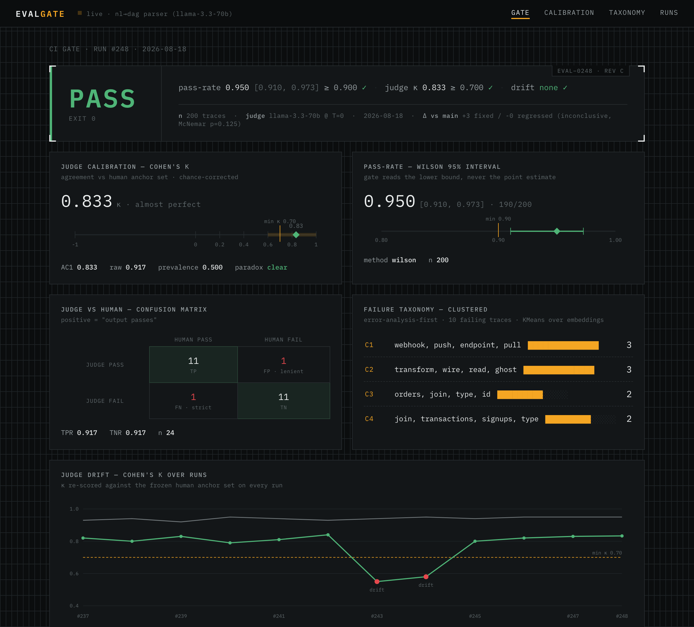
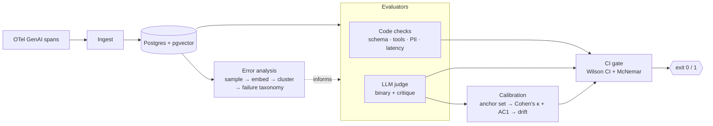

<div align="center">

# EvalGate

**A CI gate for LLM agents — the test-suite step that blocks a bad agent version from shipping.**

Most "LLM eval" tooling is a dashboard you glance at. EvalGate is a *gate*: it starts from your
real failures, evaluates with code checks + a calibrated LLM judge, and **fails the build** when
agent quality regresses — or when the judge itself drifts out of agreement with humans.

[](https://github.com/puneethkotha/evalgate/actions/workflows/ci.yml)
[](https://evalgate.pages.dev)
[](LICENSE)
[](pyproject.toml)
[](https://github.com/astral-sh/ruff)

[**Live dashboard →**](https://evalgate.pages.dev)

</div>

---

## Dashboard

An instrument-panel dashboard renders the whole gate — verdict, judge calibration (κ caliper),
pass-rate interval, the judge-vs-human confusion matrix, the failure taxonomy, and a
**judge-drift-over-runs timeline** (the evaluator, evaluated). Live at
**[evalgate.pages.dev](https://evalgate.pages.dev)**.



---

## Why

> In the 2025 *State of Agent Engineering* survey, **89% of teams running agents had observability
> — but only ~52% ran evals.** Observability tells you what happened; it doesn't stop a worse
> version from shipping.

EvalGate is the missing half: the pipeline step that turns "is this agent version good enough?"
into a single, defensible pass/fail.

It is opinionated in three ways that make the number trustworthy:

1. **Error-analysis first, not metric-first.** Before you write a single assertion, you look at
   your failures. EvalGate samples failing traces, embeds them, and clusters them into a
   **failure taxonomy** so your evaluators target the failure modes you actually have — the
   [Hamel Husain](https://hamel.dev/blog/posts/evals-faq/) / [Shreya
   Shankar](https://arxiv.org/abs/2404.12272) "look at your data" discipline, wired into the tool.
2. **The judge is calibrated, not trusted.** The LLM judge is re-scored against a frozen,
   human-labeled **anchor set** every run. EvalGate reports **Cohen's κ** (agreement corrected
   for chance) cross-checked against **Gwet's AC1** (to catch the prevalence paradox). If κ falls
   below threshold, the run is blocked and flagged as *judge drift* — not agent regression.
3. **Binary verdicts + statistics that survive tiny samples.** The judge answers pass/fail with a
   written critique (Likert scores are noise). The gate reads the **lower bound of a Wilson score
   interval**, and compares two agent versions with **McNemar's paired test**, so a two-sample
   wobble can't flip the build.

## Architecture



## Quickstart

```bash
pip install evalgate-ci      # the PyPI name; the command + import stay `evalgate`
evalgate demo                # runs the whole pipeline offline — no key, no data needed
```

`evalgate demo` points EvalGate at a reference NL→DAG parser and runs the whole pipeline —
error analysis → code checks → judge calibration → gate — end to end:

```text
┌─────────────────────────────────────────────────────────────────────────────┐
│ EVALGATE                                                                    │
├─────────────────────────────────────────────────────────────────────────────┤
│ result       : PASS  (exit 0)                                               │
│ pass-rate    : 0.950  95% CI [0.910, 0.973]  (wilson, 190/200)              │
│ min pass-rate: 0.900                                                        │
│ judge kappa  : 0.833 (almost perfect)  min 0.70  drifted=False              │
│ judge agree  : AC1 0.833  raw 0.917  TPR 0.917  TNR 0.917  prevalence 0.500 │
│ vs baseline  : +3 fixed / -0 regressed  (inconclusive, McNemar p=0.125)     │
├─────────────────────────────────────────────────────────────────────────────┤
│ RESULT: PASS                                                                │
└─────────────────────────────────────────────────────────────────────────────┘
```

Point it at your own agent — a JSONL of `{"input", "output", "status"}` (or OTel GenAI spans via
`evalgate.otel`) plus a human anchor set for judge calibration:

```bash
evalgate gate --traces traces.jsonl --anchors anchors.jsonl \
  --min-pass-rate 0.9 --min-kappa 0.7 --badge badge.json
```

### In CI (GitHub Action)

```yaml
- uses: puneethkotha/evalgate@main
  with:
    traces: traces.jsonl
    anchors: anchors.jsonl
    min-pass-rate: "0.9"
    min-kappa: "0.7"
```

It runs the gate, posts the readout as a sticky PR comment, and fails the check when the gate
fails. Prefer pytest? `from evalgate.pytest_plugin import assert_gate` drops the gate into your
existing suite.

The gate exits non-zero when the pass-rate CI lower bound drops below `min-pass-rate`, when a
McNemar test says the change is a significant regression, **or** when the judge's κ drops below
`min-kappa`.

## How the gate decides

| Signal | Fails the build when… | Why |
|---|---|---|
| **Pass-rate** | Wilson 95% CI *lower bound* < `min_pass_rate` | A lucky small sample can't sneak past the gate |
| **Version delta** | McNemar paired test flags a significant regression vs baseline | The two runs are paired (same inputs) — compare correctly |
| **Judge drift** | Cohen's κ vs the human anchor set < `min_judge_kappa` | A judge that no longer matches humans can't be trusted to grade |

## Usage

Four surfaces — pick the one that fits your stack.

**CLI**
```bash
evalgate demo                                   # offline reference run (no key, no data)
evalgate gate --traces traces.jsonl \           # gate your own agent → exit 0 / 1
  --anchors anchors.jsonl --min-pass-rate 0.9 --min-kappa 0.7 --badge badge.json
evalgate analyze  --traces traces.jsonl         # cluster failures into a taxonomy
evalgate calibrate --anchors anchors.jsonl      # judge-vs-human agreement report
evalgate report --out dashboard/report.json     # build the dashboard payload
```

**GitHub Action** — gate every PR (posts a sticky comment, fails the check):
```yaml
- uses: puneethkotha/evalgate@main
  with:
    traces: traces.jsonl
    anchors: anchors.jsonl
    min-pass-rate: "0.9"
    min-kappa: "0.7"
```

**pytest** — eval as a unit test:
```python
from evalgate.pytest_plugin import assert_gate

def test_agent_quality(agent_passes, calibration):
    assert_gate(agent_passes, min_pass_rate=0.9, calibration=calibration)
```

**Library** — compose it yourself: `evalgate.evaluators.LLMJudge`,
`evalgate.calibration.calibrate_judge`, `evalgate.gate.evaluate_gate`.

Inputs are JSONL of `{"input", "output", "status"}` (or OpenTelemetry GenAI spans via
`evalgate.otel`). Set `GROQ_API_KEY` (free tier) to use the real LLM judge; without it,
code-check and status-based gating still run offline.

## What's inside

- **`evalgate.analysis`** — error-analysis workbench: sample failing traces → embed
  (a $0, offline TF-IDF encoder by default) → cluster into an auto-labeled failure taxonomy.
- **`evalgate.evaluators`** — deterministic code checks (schema / tool success / PII / latency)
  and a binary LLM judge (chain-of-thought → verdict → critique) with length/position/self-
  preference bias mitigation and an order-swapped pairwise mode.
- **`evalgate.calibration`** — Cohen's κ + Gwet's AC1 + TPR/TNR against the anchor set, with
  degenerate-case and prevalence-paradox handling, plus a bias-corrected pass-rate.
- **`evalgate.stats`** — Wilson score interval, McNemar's exact paired test, Landis–Koch bands.
- **`evalgate.gate`** — composes the above into one structured `GateReport` and a shell exit code.
- **`evalgate.cli`** — the `evalgate` command: `demo`, `gate`, `analyze`, `calibrate`, `--json`,
  and a Shields badge writer.
- **`evalgate.otel`** — a version-tolerant OpenTelemetry-GenAI span → trace adapter.

## Privacy & cost

EvalGate runs locally and is **$0 to operate**: the default embedding encoder needs no model
download and no network, and the LLM judge uses any OpenAI-compatible endpoint (the Groq free
tier by default; bring your own key). Your prompts, traces, anchors, and thresholds are files in
**your** repo — nothing is sent anywhere except the judge model you configure.

## Status

Shipped and tested: the evaluation core (analysis, evaluators, calibration, statistics, gate),
the `evalgate` CLI, the pytest plugin, the base-vs-PR GitHub Action, and the OTel-GenAI ingestion
adapter. In active development: the instrument-panel web dashboard.

## Reference integration

[`examples/eval_flint_parser.py`](examples/eval_flint_parser.py) evaluates an NL→DAG parser:
code checks are *is-a-DAG* (Kahn's algorithm), legal node types, and edges-resolve; the judge
checks that the plan faithfully represents the request (no missing or hallucinated steps).

## Contributing

`pip install -e ".[dev]"`, then `python -m pytest` and `ruff check evalgate tests examples`.
[`ARCHITECTURE.md`](ARCHITECTURE.md) is the bird's-eye map — codemap + the invariants that keep
the gate honest.

## License

[MIT](LICENSE)
